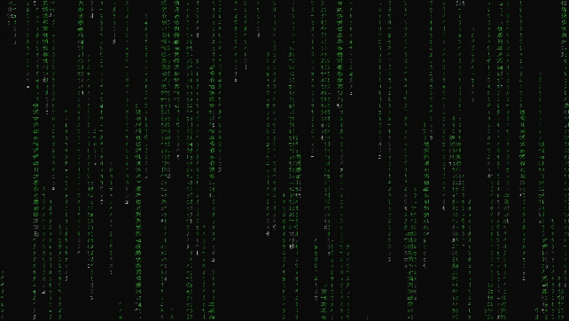

# 💻 Matrix Rain (C++ Console Edition)

A beautiful **Matrix-style digital rain** animation written in **pure C++**, rendered directly in the **Windows console** using `CHAR_INFO` buffers for fast, flicker-free updates.

---

## 🌌 Preview



## ✨ Features

- Smooth **real-time animation** using `WriteConsoleOutput`
- Dynamic **FPS display** in the title bar
- Randomized **character streams** with varied speeds and lengths
- Different **green shades** to simulate trail fading
- Fully configurable screen width, height, and number of rain drops

---

## ⚙️ Code Structure

| Function / Component | Description |
|----------------------|-------------|
| `initializeRainDrop()` | Initializes a single rain drop with random position, speed, and characters |
| `createScreenBuffer()` | Creates and activates the console screen buffer |
| `initializeMatrix()` | Spawns multiple rain drops into the vector |
| `clearScreen()` | Clears the screen buffer for the next frame |
| `drawCharacterOnScreen()` | Draws a single Unicode character at `(x, y)` with color |
| `update()` | Main render loop — updates positions, colors, and draws frames |
| `main()` | Initializes everything and starts the simulation |

---

## 🧩 How It Works

1. Each **MatrixRainDrop** contains:
   - X-position
   - Y-position
   - Drop speed
   - Random string of characters (`wstring`)

2. The main loop updates Y-position per frame:
   ```cpp
   drop.yPosition += drop.dropSpeed * elapsedTime;
3. Each drop’s text is drawn vertically:
   ```cpp
   drawCharacterOnScreen(x, y, textContent[j], color);
4. Color intensity fades as you move down the trail:
   ```cpp
   if (j == 0) color = WHITE;
   else if (j <= 2) color = GRAY;
   else if (dropSpeed > 20) color = GREEN;
   else color = LIGHT_GREEN;
5. The final frame is drawn to the console in one call:
   ```cpp
   WriteConsoleOutput(hConsole, screen, bufferSize, {0, 0}, &rect);

## 🧰 Requirements

- **OS:** Windows 10 / 11  
- **Compiler:** Visual Studio (MSVC)  
- **Language Standard:** C++17 or later

---

## 🚀 How to Run

1. Clone the repository:
   ```bash
   git clone https://github.com/mni007nomi/Matrix-Rain-Effect.git

2. Open the project in Visual Studio or compile manually

## ⚡ Customization

You can tweak several parameters in the code to control the appearance and behavior of the Matrix Rain effect.

| **Variable** | **Default Value** | **Description** |
|---------------|-------------------|-----------------|
| `screenWidth` | `180` | Console width in columns |
| `screenHeight` | `50` | Console height in rows |
| `TOTAL_RAIN_DROPS` | `180` | Total number of falling rain streams |
| `minDropSpeed` | `5.0f` | Minimum vertical speed of a raindrop |
| `rangeDropSpeed` | `40` | Range added to the minimum speed for variation |
| `minTextLength` | `5` | Minimum length of the text trail per raindrop |
| `rangeTextLength` | `20` | Variation in text trail length |
| `minASCIICharacter` | `0x30A0` | Lower bound of the ASCII range for Japanese Katakana symbols |
| `rangeASCIICharacter` | `0x30FF - 0x30A0` | Number of ASCII values used for Katakana symbol generation |

To make changes, simply modify these variables in the source code before compiling.

## 💡 Concept

This project recreates the **Matrix Rain** effect (inspired by *The Matrix* movie) directly in a Windows console using pure C++.

Each *raindrop* is represented by a vertical stream of random characters that fall at varying speeds.  
The logic behind the effect includes:

1. **Character Generation** — Each raindrop is made of random ASCII symbols, giving a digital code-like appearance.
2. **Falling Animation** — Each frame updates the Y-position of every raindrop based on its individual speed.
3. **Trail Rendering** — Characters in each stream fade from bright white (head) to dim green (tail), simulating depth and motion.
4. **Console Buffering** — The screen is drawn into a memory buffer (`CHAR_INFO` array) and then rendered all at once using `WriteConsoleOutput` to prevent flickering.
5. **FPS Calculation** — Frame rate is calculated from elapsed frame time and displayed in the console title bar.

This combination creates a smooth, high-performance text-based animation running directly in the Windows console.